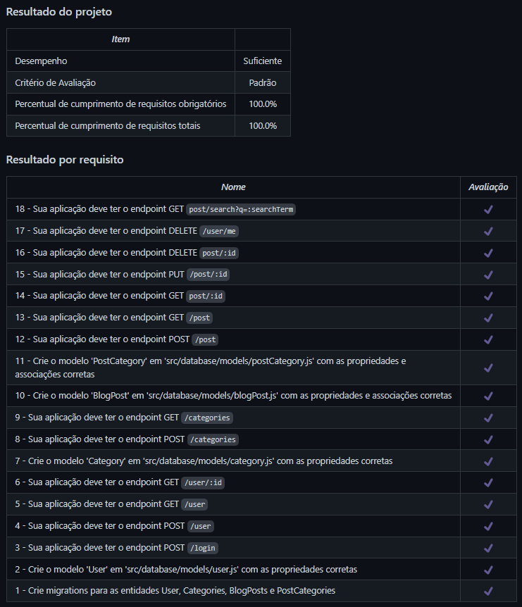

# Blogs API
Projeto da [Trybe](https://www.betrybe.com/) - Bloco 24 - REST API para gestão de blog feita com Node.js e Sequelize.

## 💻 Projeto

API RESTful para uma aplicação de produção de conteúdo para um blog utilizando Node.js e Sequelize.

<details>
  <summary><strong>🏆 Meu desempenho</strong></summary><br />

  
</details>

## 🚀 Tecnologias
> Este projeto foi desenvolvido com as seguintes tecnologias:

- Node.js
- Sequelize

## 📌 Habilidades

> Neste projeto, desenvolvi as seguintes habilidades:

- Desenvolver uma API RESTful de um CRUD (Create, Read, Update e Delete);
- Utilizar o ORM Sequelize para a leitura e escrita em um banco de dados MySQL/PostgreSQL.

## ⬇️ Instalando dependências

```bash
npm install
``` 

## ⚡ Executando a aplicação

> Inicialmente é preciso configurar um banco de dados MySQL:
- Definindo as varáveis de ambiente em um arquivo `.env`;
- Criando o banco de dados e as tabelas com:
```bash
npx sequelize db:create
npx sequelize db:migrate
```
- Se desejado, populando as tabelas com dados iniciais com:
```bash
npx sequelize db:seed:all
```
> Após isso, a aplicação pode ser iniciada com:
```bash
npm start
``` 

## 🧪 Executando os testes

```bash
npm test
```

## 💬 Contatos

<div align="center" style="display: inline_block">
  <a href="https://julianoboese.github.io" target="_blank"></a> 
  <a href="https://www.linkedin.com/in/julianoboese" target="_blank"></a> 
  <a href = "mailto:juliano.boese@gmail.com"></a>
</div>

<!-- ## 📄 Licença

Esse projeto está sob licença. Veja o arquivo [LICENÇA](LICENSE.md) para mais detalhes.

[⬆ Voltar ao topo](#nome-do-projeto)<br> -->
